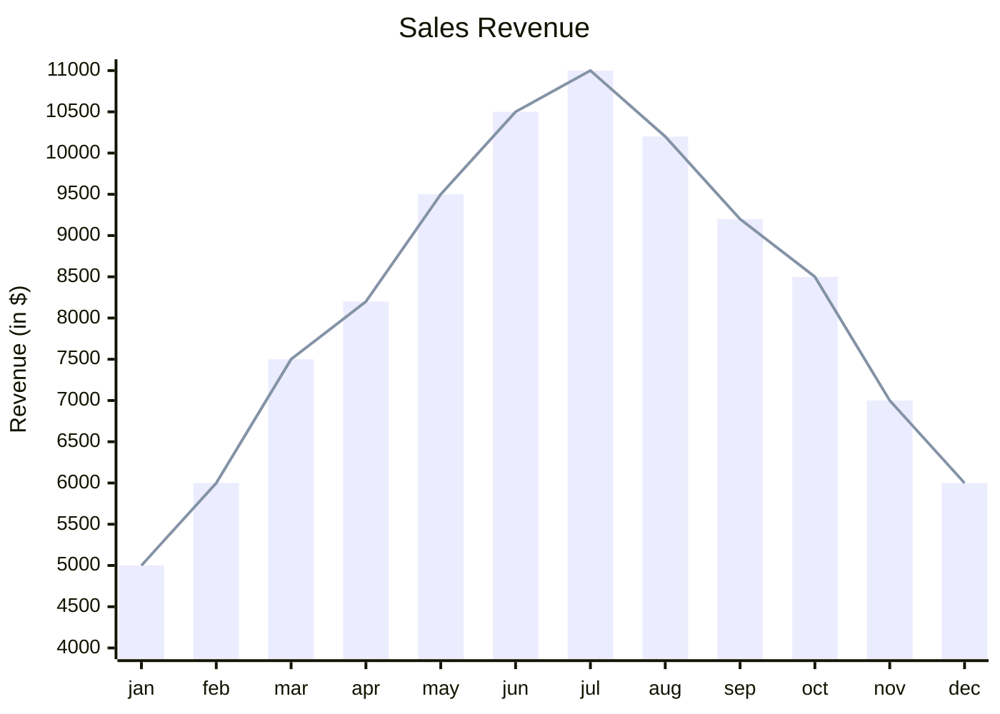
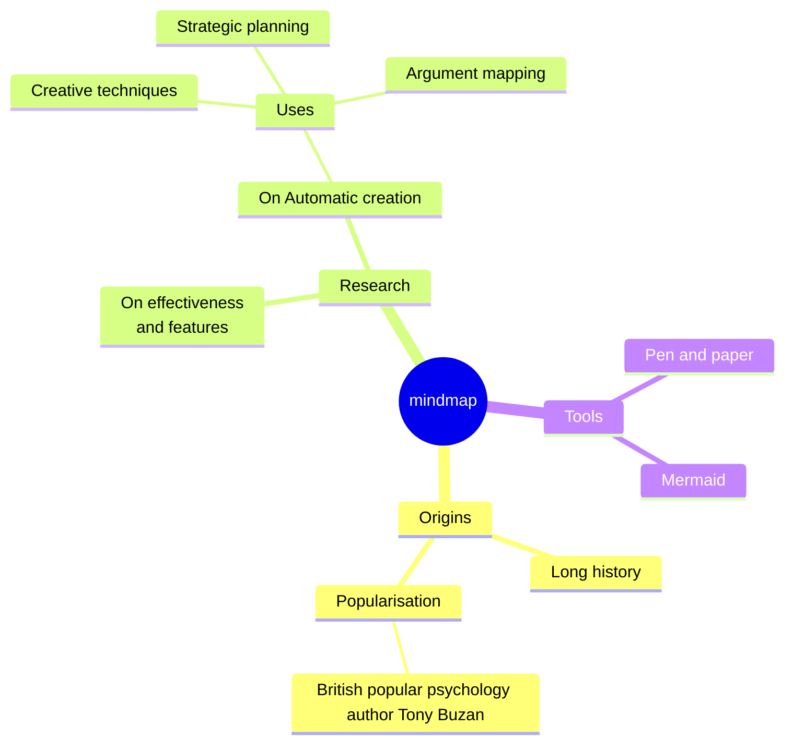
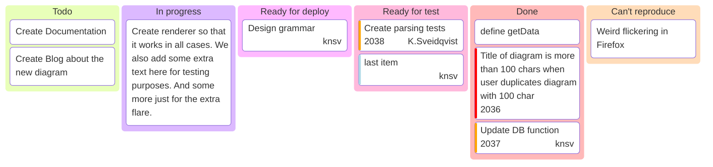
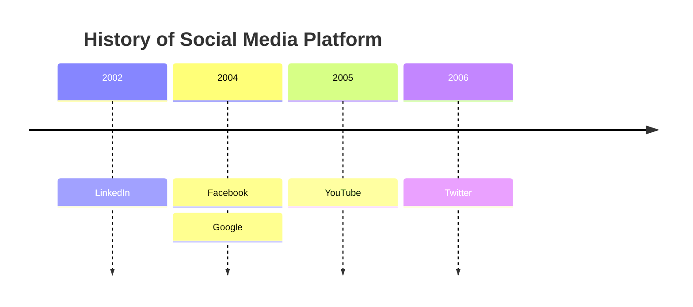

# Sand box

<!-- toc -->

## Markdown ...

### Math

#### Inline

$\oint_S \vec{D} \cdot \hat{n} = \int_0^\pi \int_0^{2\pi}\~D_r\~r^2\~sin\theta\~d\phi\~d\theta = 4\pi r^2 D_r$

#### Block

$$
\begin{align}
	f(x)  & = x^2            \\\\
	f'(x) & = 2x             \\\\
	F(x)  & = \int f(x)dx    \\\\
	F(x)  & = \frac{1}{3}x^3
\end{align}
$$

### Image


### Du code

```python
def f(n):
    if n < 2:
        return 1
    return f(n - 2) + f(n - 1)
```

## ... et autres

### Table Of Content

```
<!-- toc -->
```

### Emojis

[Emojicodes list](https://gist.github.com/rxaviers/7360908#file-gistfile1-md)

:smile: :laughing: :blush: :smiley: :relaxed: :smirk: :heart_eyes: :kissing_heart: :kissing_closed_eyes: :flushed: :relieved: :satisfied: :grin: :wink:
:shit: :+1: :thumbsup: :-1: :thumbsdown: :ok_hand: :punch: :facepunch: :fist: :v: :wave: :hand: :raised_hand: :open_hands: :point_up: :point_down: :point_left: :point_right: :raised_hands: :pray: :point_up_2: :clap: :muscle: :metal: :fu: :walking: :runner: :running: :couple: :family:

### Admonish

```admonish def

[Avec du code dedans](https://tommilligan.github.io/mdbook-admonish/#nested-markdownhtml)

Lorem Ipsum is simply dummy text of the printing and typesetting industry.
```

```admonish ex
Lorem Ipsum is simply dummy text of the printing and typesetting industry.
```

```admonish prop
Lorem Ipsum is simply dummy text of the printing and typesetting industry.
```

```admonish prop title="Caché !!!!" collapsible=true
Lorem Ipsum is simply dummy text of the printing and typesetting industry. Lorem Ipsum has been the industry's standard dummy text ever since the 1500s, when an unknown printer took a galley of type and scrambled it to make a type specimen book. It has survived not only five centuries, but also the leap into electronic typesetting, remaining essentially unchanged. It was popularised in the 1960s with the release of Letraset sheets containing Lorem Ipsum passages, and more recently with desktop publishing software like Aldus PageMaker including versions of Lorem Ipsum.
```

```admonish demo
Lorem Ipsum is simply dummy text of the printing and typesetting industry.
```

```admonish rem
Lorem Ipsum is simply dummy text of the printing and typesetting industry.
```

```admonish methode
Lorem Ipsum is simply dummy text of the printing and typesetting industry.
```

```admonish alert
Lorem Ipsum is simply dummy text of the printing and typesetting industry.
```

### Mermaid

[Mermaid Live](https://mermaid.live/edit)








