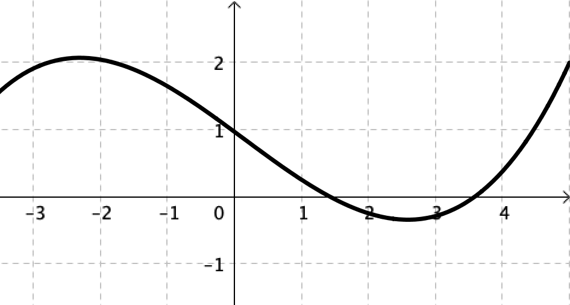
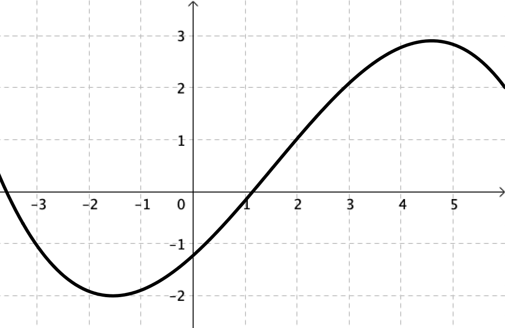

# Convexité

<!-- toc -->

## Dérivée seconde

```admonish def
Soit une fonction $f$dérivable sur un intervalle $I$ dont la dérivée $f\prim$ est dérivable sur $I$.

On appelle **fonction dérivée seconde** de $f$ sur $I$ la dérivée de $f\prim$ et on note : $$f\pprim(x) = \left( f\prim(x) \right)\prim$$
```

```admonish meth title="Méthode : Calculer la dérivée seconde d'une fonction"
Calculer la dérivée seconde de chacune des fonctions $f$, $g$ et $h$ définies par :

1. $f(x) = {3x}^{3} - 5x^{2} + 1$
2. $g(x) = xe^{x}$
3. $h(x) = \cos(2x)$

---

1. $f\prim(x) = {9x}^{2} - 10x$

   $f\pprim(x) = \left( f\prim(x) \right)\prim = 18x - 10$

2. $g\prim(x) = 1 \times e^{x} + xe^{x} = e^{x}(1 + x)$

   $g\pprim(x) = e^{x}(1 + x) + e^{x} \times 1 = e^{x}(2 + x)$

3. $h'(x) = -2\sin(2x)$

   $h\pprim(x) = -2\times 2\cos(2x) = -4\cos(2x)$
```

## Fonction convexe et fonction concave

### Définitions avec les cordes

```admonish def
Une **corde** est un segment reliant deux points d'une courbe.


```

```admonish def
Soit une fonction $f$ définie sur un intervalle $I$.

- La fonction $f$ est **convexe** sur $I$, si $\Cf$ est entièrement située en **dessous** de chacune de ses cordes.

- La fonction $f$ est **concave** sur $I$, si $\Cf$ est entièrement située **au-dessus** de chacune de ses cordes.

|           Fonction concave            |           Fonction convexe            |
| :-----------------------------------: | :-----------------------------------: |
|  |  |
```

### Définitions avec les tangentes

```admonish def
Soit une fonction $f$ dérivable sur un intervalle $I$.

- La fonction $f$ est **convexe** sur $I$, si $\Cf$ est entièrement située **au-dessus** de ses tangentes.

- La fonction $f$ est **concave** sur $I$, si $\Cf$ est entièrement située en **dessous** de ses tangentes.

|           Fonction concave            |           Fonction convexe            |
| :-----------------------------------: | :-----------------------------------: |
|  |  |
```

```admonish meth title="Méthode : Reconnaître graphiquement la convexité"
Reconnaître graphiquement la convexité des deux fonctions représentées
sur l'intervalle $\lbrack -3 ; 5\rbrack$.

|                 fig.1                 |                 fig.2                 |
| :-----------------------------------: | :-----------------------------------: |
|  |  |

---

1. La fonction est **concave**. Sa courbe est entièrement située en dessous de chacune de ses tangentes.
2. La fonction est d'abord **convexe** puis **concave**.

|                 fig.1                 |                 fig.2                  |
| :-----------------------------------: | :------------------------------------: |
|  |  |

On aurait pu obtenir ses résultats en utilisant les cordes.
```

### Convexité et dérivée seconde

```admonish prop
- La fonction carré $x \mapsto x^{2}$ est **convexe** sur $\R$.

- La fonction cube $x \mapsto x^{3}$ est **concave** sur $\left\rbrack - \infty;0 \right\rbrack$ et **convexe** sur $\left\lbrack 0; + \infty \right\lbrack$.

- La fonction inverse $x \mapsto$ $\cfrac{1}{x}$ est **concave** sur $\left\rbrack - \infty;0 \right\lbrack$ et **convexe** sur $\left\rbrack 0; + \infty \right\lbrack$.

- La fonction racine carrée $x \mapsto \sqrt{x}$ est **concave** sur $\left\lbrack 0; + \infty \right\lbrack$.
```

```admonish prop
Soit une fonction $f$ définie et deux fois dérivable sur un intervalle
$I$.

- Dire que $f$ est **convexe** sur $I$, revient à dire que $f\prim$ est **croissante** sur $I$, soit : $$\boxed{f\pprim(x) \ge 0}$$
- Dire que $f$ est **concave** sur $I$, revient à dire que $f\prim$ est **décroissante** sur $I$, soit : $$\boxed{f\pprim(x) \le 0}$$
```

```admonish rem
Dans la pratique, pour étudier la convexité d'une fonction, on détermine le signe de $f\pprim$.
```

```admonish demo title="Démonstration : $f$ est convexe, si $f'$ est croissante"
On considère $g$ dérivable sur $I$ et définie par : $\ g(x) = f(x) - (f\prim(a)(x - a) + f(a))$.

On a : $g\prim(x) = f\prim(x) - f\prim(a)$

Or $f\prim$ est croissante sur $I$, donc $g'$ est également croissante.

De plus, on a :

- $g\prim(a) =f\prim(a) - f\prim(a)= 0\$
  - $\Rarr\ g\prim\le 0$ pour $x \le a$
  - $\Rarr\ g\prim(x)\ge 0$ pour $x \ge a$.

- $g(a) = f(a) - f\prim(a)(a - a) - f(a) = 0$

On peut donc compléter le tableau de variations de $g$.


Donc, sur $I$, on a :

$$
\begin{array}{rcl}
	g(x) \ge 0 & \iff & f(x)-\pa{f\prim(a)(x-a)+f(a)}\ge 0    \\\\
	           & \iff & f(x) \ge f\prim(a)(x - a) + f(a)
\end{array}
$$

On en déduit que $\Cf$ est au-dessus de ses tangentes sur $I$ et donc que $f$ est convexe sur $I$.
```

```admonish meth title="Méthode : Étudier la convexité d'une fonction"
Soit la fonction $f$ définie sur $\R$ par $f(x) = \cfrac{1}{3}x^{3} - 9x^{2} + 4$

:bulb: Étudier la convexité de la fonction $f$.

---

On a : $\ f\prim(x) = x^{2} - 18x\ $ et $\ f\pprim(x) = 2x - 18$

Signe de $f\pprim$ : $\ f^{''}(x) \ge 0\quad\iff\quad 2x-18 \ge 9\quad\iff\quad x\ge 9$

- Pour tout $x \le 9$, $f\pprim(x) \le 0\ \iff\ f$ est **concave** sur $\left\rbrack -\infty;9 \right\rbrack$
- Pour tout $x \ge 9$, $f\pprim(x) \ge 0\ \iff\ f$ est **convexe** sur $\left\lbrack 9; +\infty \right\lbrack$
```

## Point d'inflexion

```admonish def
Soit une fonction $f$ dérivable sur un intervalle $I$.

Un **point d'inflexion** est un point où la courbe traverse sa tangente.


```

```admonish prop
Au point d'inflexion, la fonction change de convexité.
```

```admonish ex


On considère la fonction cube $x \mapsto x^{3}$.

La tangente en $0$ est l'axe des abscisses.

- Pour $x \le 0$, la courbe est en dessous de sa tangente.
- Pour $x \ge 0$, la courbe est au-dessus de sa tangente.

La tangente à la courbe traverse donc la courbe en ce point.

L'origine est donc **le point d'inflexion** de la courbe de la fonction cube.
```

```admonish meth title="Méthode : Reconnaître graphiquement un point d'inflexion"
:bulb: Déterminer graphiquement le point d'inflexion des fonctions représentées ci-dessous.

|                 fig.1                 |                 fig.2                 |
| :-----------------------------------: | :-----------------------------------: |
| {height=4cm} | {height=4cm} |

---

1. La fonction est d'abord **concave** puis **convexe**.

   Le point de coordonnées $\coordl{0}{1}$ semble être un point d'inflexion de la courbe.

2. La fonction est d'abord **convexe** puis **concave**.

   Le point de coordonnées $\coordl{2}{1}$ semble être un point d'inflexion de la courbe.

|                 fig.1                  |                 fig.2                  |
| :------------------------------------: | :------------------------------------: |
|  |  |
```

```admonish meth title="Méthode : Étudier la convexité pour résoudre un problème"
Une entreprise fabrique des clés USB avec un maximum de $10\ 000$ par mois.

Le coût de fabrication $C$ (en milliers d'euros) de $x$ milliers de clés produites s'exprime par :

$$C(x) = 0,05x^{3} - 1,05x^{2} + 8x + 4\qquad\text{définie sur}\ \lbrack 0\ ;\ 10\rbrack$$

1. À l'aide de la calculatrice, conjecturer la convexité de la fonction $C$.

   En déduire si la courbe possède un point d'inflexion.

2. Démontrer ces résultats.
3. Interpréter les résultats obtenus au regard du contexte de l'exercice.

---

1. _Convexité (graphiquement)_

> La fonction semble **concave** sur l'intervalle $\lbrack 0\ ;\ 7\rbrack$ et **convexe** sur l'intervalle $\lbrack 7\ ;\ 10\rbrack$.
>
> La courbe semble posséder un point d'inflexion pour $x = 7$.
>
> 

2. _Convexité (démonstration)_

> On a :
>
> - $C(x) = 0,05x^{3} - 1,05x^{2} + 8x + 4$
> - $C'(x) = 0,15x^{2} - 2,1x + 8$
> - $C''(x) = 0,3x - 2,1$
>
> Or, $C''(x) = 0,3x - 2,1 > 0\quad\iff\quad x > 7$
>
> On peut ainsi résumer les variations de $C'$ et la convexité de $C$ dans le tableau suivant :
>
> 
>
> On a $\ C(7) = 25,7\ $ donc le point de coordonnées $\coordl{7}{25,7}$ est un point d'inflexion de la courbe.

3. _Interprétations_

> Avant le point d'inflexion, $C$ est **concave**, la croissance du coût de fabrication ralentie.
>
> Après le point d'inflexion, $C$ est **convexe**, la croissance du coût de fabrication s'accélère.
>
> Ainsi, à partir de $7\ 000$ clés produites, la croissance du coût de fabrication s'accélère.
```

```admonish meth title="Méthode : Prouver une inégalité en utilisant la convexité d'une fonction"
Soit la fonction $f$ définie sur $\R$ par $\ f(x) = x^{3} - 2x^{2}$

a. Étudier la convexité de la fonction $f$.

b. Déterminer l'équation de la tangente à la courbe de la fonction $f$ en $-1$.

c. En déduire que pour tout réel $x$ négatif, on a : $\ x^{3} - 2x^{2} \le 7x + 4$.

---

a. _Convexité de $f$_

> On a :
>
> - $f\prim(x) = {3x}^{2} - 4x$.
> - $f\pprim(x) = 6x - 4$ qui s'annule pour $x =$ $\cfrac{2}{3}$.
>
> Donc :
>
> - Pour tout $x \le \cfrac{2}{3}$, on a : $f\pprim(x) \le 0$
>
> - Pour tout $x \ge \cfrac{2}{3}$, on a : $f\pprim(x) \ge 0$
>
> Donc $f$ est **concave** sur $\left\rbrack - \infty;\cfrac{2}{3} \right\rbrack$ et $f$ est **convexe** sur $\left\lbrack \cfrac{2}{3}; + \infty \right\lbrack$.

b. _Tangente en $-1$_

> L'équation de la tangente à $\Cf$ en $-1$ est de la forme : $$y = f\prim(-1)\left( x - (-1) \right) + f(-1)$$
>
> Avec :
>
> - $\ f\prim(-1) = {3 \times (-1)}^{2} - 4 \times (-1) = 7\ $
> - $\ f(-1) = (-1)^{3} - 2{\times (-1)}^{2} = - 3$
>
> Donc, l'équation de la tangente en $-1$ est : $\quad y = 7(x + 1) - 3\quad\iff\quad y = 7x + 4$

c. $x^{3} - 2x^{2} \le 7x + 4$

> $f$ est **concave** sur $\left\rbrack - \infty;\cfrac{2}{3} \right\rbrack$ donc sur cet intervalle, $\Cf$ est située en dessous de ses tangentes.
>
> Donc, en particulier, $\Cf$ est située en dessous de la tangente en $-1$.
>
> On a ainsi sur $\left\rbrack -\infty;\cfrac{2}{3} \right\rbrack$ : $\quad f(x) \le 7x + 4\quad\iff\quad x^{3} - 2x^{2} \le 7x + 4$
>
> 
```

```

```
